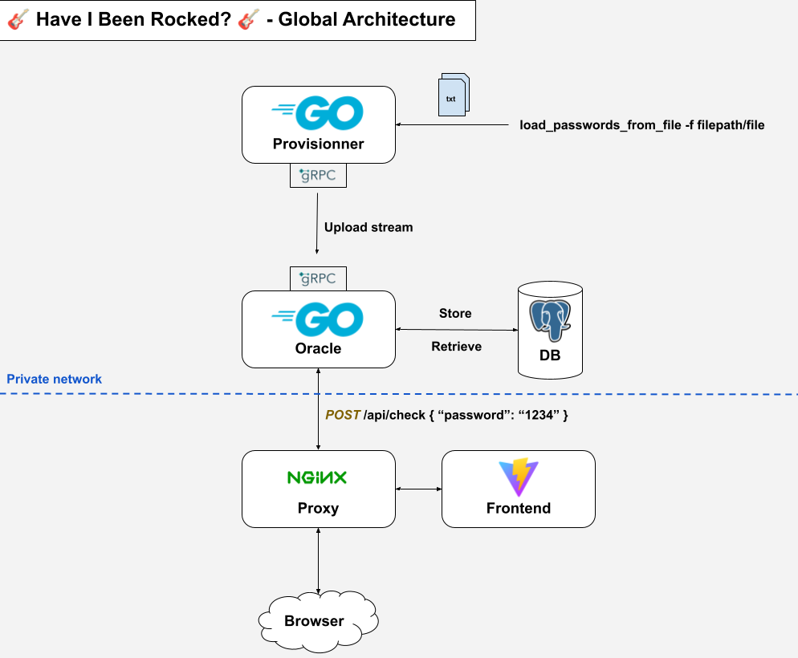

# Challenge Technique: HaveIBeenRocked

## Présentation du projet

**HaveIBeenRocked** est un projet qui permet aux utilisateurs de vérifier si leurs mots de passe ont été compromis dans une fuite de données. Il fournit une interface web front pour effectuer ces vérifications ainsi que pour générer des mots de passe aléatoires et sécurisés en suivant les recommandations de sécurité.

## Architecture du projet

Le projet est construit sur une architecture modulaire pour garantir sa flexibilité, sa scalabilité et sa facilité de maintenance. Il comprend les composants suivants :

- **Interface Utilisateur** : Développée en React (framework Vite), elle permet aux utilisateurs de transmettre leur mot de passe et de vérifier s'il est compromis dans une fuite de données, intégrant également une fonctionnalité de génération de mots de passe aléatoires.
- **Serveur Backend Oracle** : Construit en Go, il gère les requêtes depuis l'interface utilisateur, communique avec la base de données pour vérifier si l'empreinte des mots de passe est présente dans sa base de fuites de données et expose une API gRPC pour permettre à des services externes de transmettre des mots de passe compromis.
- **Service CLI Provisionner** : Construit en Go, il permet d'importer des mots de passe selon une stratégie d'import. Par défaut, la seule stratégie implémentée est celle de chargement des mots de passe depuis un fichier. Il génère ensuite des lots de mots de passe qu'il transmet via gRPC à l'oracle qui se charge de stocker les empreintes dans la base de données.
- **Base de Données** : Base de données PostgreSQL pour stocker les empreintes des mots de passe compromis dans les fuites de données.

## Architecture globale



## Récupération des sources et configuration de l'environnement

1. **Cloner le dépôt :**

    ```bash
    git clone git@github.com:Zando74/HaveIBeenRocked.git
    cd HaveIBeenRocked
    ```

2. **Configurer l'environnement :**

    - Assurez-vous d'avoir Go, Node.js et PostgreSQL installés sur votre machine, si vous ne souhaitez pas utiliser Docker.
    - Modifiez les fichiers `config.yml` présents dans les deux services pour configurer les paramètres de votre environnement.
    - Si vous utilisez Docker, vous pouvez utiliser le fichier `docker-compose.dev.yml` pour configurer votre environnement en surchargeant les paramètres de configuration par défaut.

3. **Lancer les tests d'intégration (optionnel) :**

    - Pour les deux services (leak_oracle et leak_provisionner), exécutez :
    
        ```bash
        make install
        make test-integration
        ```

## Comment exécuter le projet (Avec Docker)

Suivez les étapes ci-dessous pour exécuter ce projet sur votre machine locale avec Docker :

1. Dans le répertoire `infra`, exécutez :
    ```bash
    make start-dev
    ```
    Cela lancera le service Oracle, la base de données, un serveur Nginx pour le frontend et permettra d'accéder au backend par reverse proxy.

2. Dans le répertoire `infra`, **une fois que les services sont correctement lancés**, exécutez :
    ```bash
    make up-provisionner
    ```
    Cela lancera la CLI (leak_provisionner) qui importera des mots de passe depuis le fichier `files/rockyou.txt`.
    *Important : L'import de mots de passe peut prendre plusieurs minutes. Une fois un mot de passe importé, il ne sera plus réimporté. Si vous arrêtez l'opération, vous pouvez relancer l'opération qui n'importera que les mots de passe manquants.*

3. Une fois l'import terminé, vous pouvez accéder à l'application en allant sur `http://localhost:80`.

4. Pour stopper les services, exécutez :
    ```bash
    make stop-dev
    ```

## Comment exécuter le projet (Sans Docker)

Suivez les étapes ci-dessous pour exécuter ce projet sur votre machine locale :

1. **Installer les dépendances :**

    - Pour les deux services (leak_oracle et leak_provisionner), exécutez :
    
        ```bash
        make install
        ```

    - Pour le frontend, allez dans le répertoire du client et exécutez :

        ```bash
        npm install
        ```

2. **Lancer le projet :**
    *Important : Nécessite **PostgreSQL installé** et d'adapter les fichiers de configurations `config.yml` de chaque service (internal/config/config.yml) pour accéder à la base de données. Et pour le serveur grpc (a priori, host: localhost)*

    - Démarrez l'oracle en mode dev (leak_oracle):
    
        ```bash
        make run-dev
        ```

    - Une fois l'oracle démarré, lancez la CLI (leak_provisionner) :
        ```bash
        make run-dev
        ```
    Cela lancera la CLI (leak_provisionner) qui importera des mots de passe depuis le fichier `files/rockyou.txt`.
    *Important : L'import de mots de passe peut prendre plusieurs minutes. Une fois un mot de passe importé, il ne sera plus réimporté. Si vous arrêtez l'opération, vous pouvez relancer l'import qui n'importera que les mots de passe manquants.*
    
    - Démarrez l'interface utilisateur frontend :
    
        ```bash
        npm run dev
        ```

3. **Accéder à l'application :**

    Ouvrez votre navigateur et accédez à `http://localhost:5173` pour utiliser l'application. N'oubliez pas de modifier le fichier `.env` pour configurer le port du backend (par défaut: 8080).
